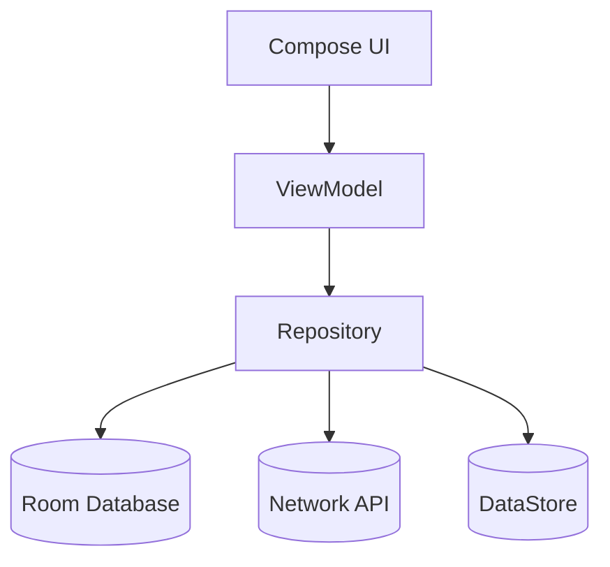
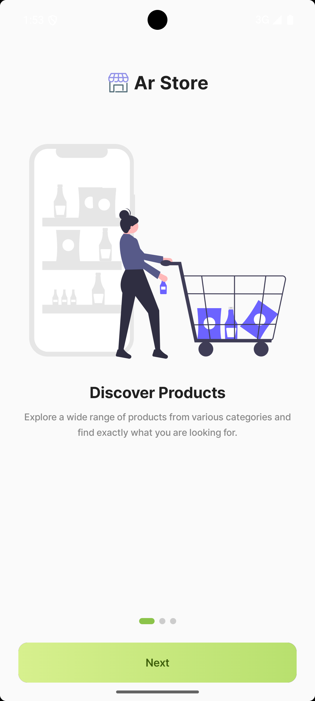
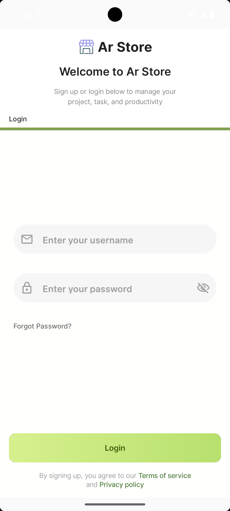
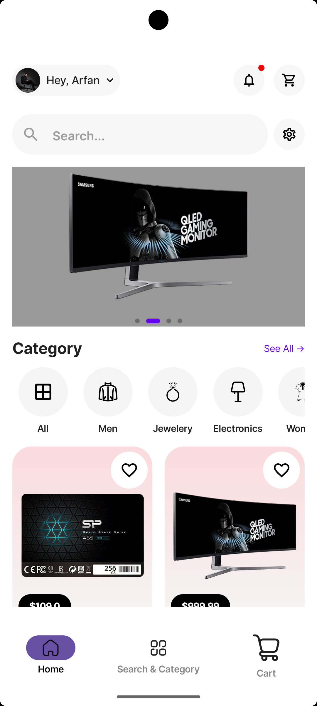
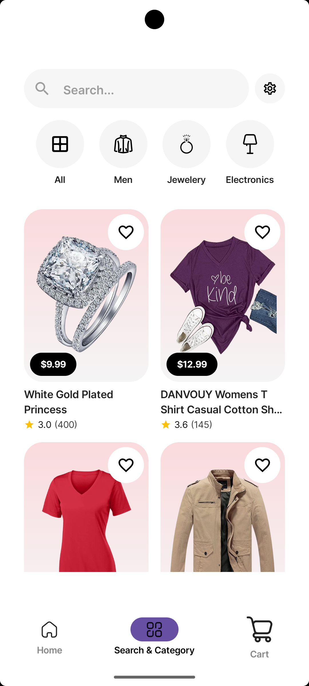
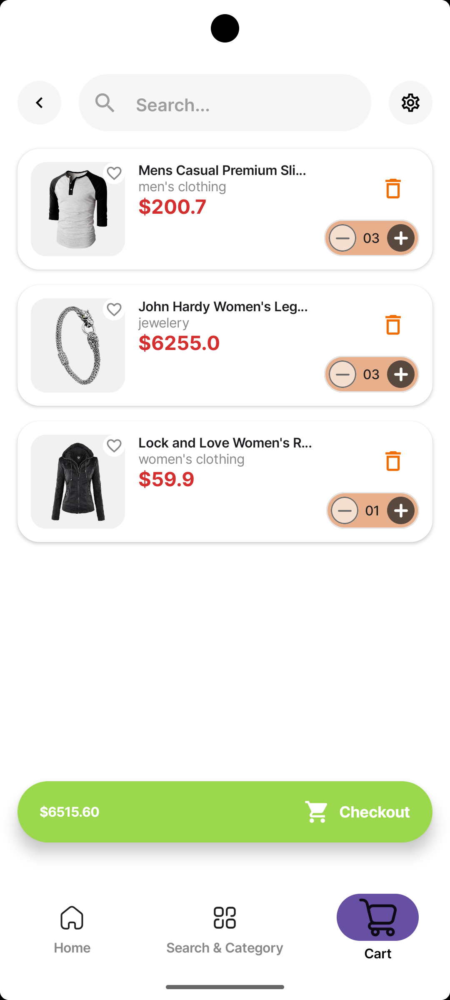
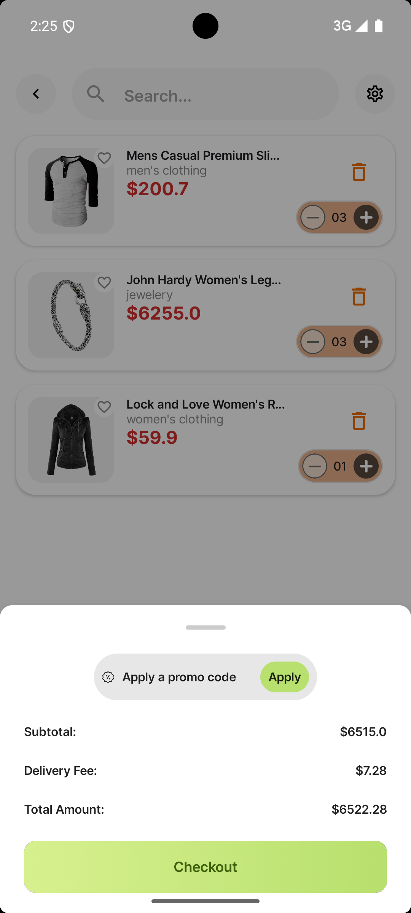
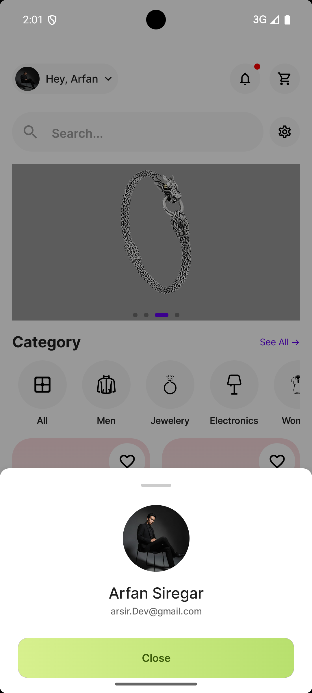

# 🛒 Arsir Store (Android App)

**Arsir Store** adalah aplikasi **mobile e-commerce Android** yang dibangun menggunakan **Jetpack Compose** dengan arsitektur modern dan scalable. Aplikasi ini berfokus pada pengalaman belanja yang cepat, sederhana, dan intuitif, mulai dari eksplorasi produk hingga proses checkout.

---

## ✨ Features

* 🔐 Authentication (Login)
* 🚀 Onboarding (hanya saat pertama install)
* 🏠 Home (List Produk & Kategori)
* 🔍 Search Produk
* 📂 Filter Produk berdasarkan Kategori
* ❤️ Favorite Produk
* 🛒 Cart
  * Hapus item
  * Update quantity
  * Realtime total price
* 💳 Checkout (Bottom Sheet)
* 👤 Profile (Bottom Sheet)
* 💾 DataStore (Session & Onboarding state)
* ⚠️ Error Handling (Loading, Empty State, Error Modal)

---

## 🧱 Tech Stack

| Layer                | Technology                                |
| -------------------- | ----------------------------------------- |
| UI                   | Jetpack Compose                           |
| Navigation           | Navigation Compose + BottomSheetNavigator |
| Architecture         | MVVM                                      |
| State Management     | StateFlow                                 |
| Async                | Kotlin Coroutines & Flow                  |
| Dependency Injection | Hilt                                      |
| Local Database       | Room                                      |
| Preferences          | DataStore                                 |
| Serialization        | Kotlinx Serialization                     |

---

## 📐 Architecture Overview

Aplikasi ini menggunakan **Clean MVVM Architecture** dengan pemisahan tanggung jawab yang jelas untuk memudahkan maintenance dan scaling.

### 🔁 Data Flow

```
UI (Compose)
   ↓ user action
ViewModel
   ↓ state & intent & business logic
Repository
   ↓ data source
Room / Network / DataStore
```

---

## 🏗️ Architecture Diagram



---

## 📱 App Flow

```
Splash Screen
 ├─ First Install → Onboarding
 │                  └─ Login
 └─ Reopen App → Login / Home
```

---

## 🛍️ Screens

* Splash Screen
* Onboarding
* Login
* Home
* Search
* Category
* Product Detail
* Cart
* Checkout (Bottom Sheet)
* Profile (Bottom Sheet)

---

## 🧪 State & Error Handling

Aplikasi menangani beberapa kondisi berikut:

* Loading state
* Empty cart
* Empty search result
* Error network / general error
* Modal dialog untuk error

---

## 📱 App Screenshots

| Splash | Onboarding |
|--------------------|------|
|  |  |

| Login |
|--------------------|------|
|  |

| Home | Product Detail |
|---------------|------|
|  |  |

| Search & Category | Cart |
|---------------|------|
|  |  |

| Checkout | Profile |
|---------|---------|
|  |  |

---

## 🛠️ Setup Project

### 1️⃣ Clone Repository

```bash
git clone [Ar Store](https://github.com/username/arsir-store.git)
```

### 2️⃣ Open Project

* Android Studio Iguana / Hedgehog
* JDK 17

### 3️⃣ Run App

```text
▶ Run 'app'
```

---

## 📦 Key Dependencies

```kotlin
implementation(platform(libs.compose.bom))
implementation(libs.navigation.compose)
implementation(libs.hilt.android)
implementation(libs.room.ktx)
implementation(libs.datastore.preferences)
implementation(libs.kotlinx.serialization)
```

---

## 🚧 Future Improvements

* Payment gateway integration
* Order history
* Address management
* Dark mode
* Pagination
* Unit Test & UI Test

---

## 👨‍💻 Author

**Arfan Siregar**
Android Developer

* GitHub: [Arsir-Dev](https://github.com/arsir-dev)
* LinkedIn: [Arfan Siregar](https://www.linkedin.com/in/arfan-siregar/)

---

## 📄 License

This project is licensed under the **MIT License**.
